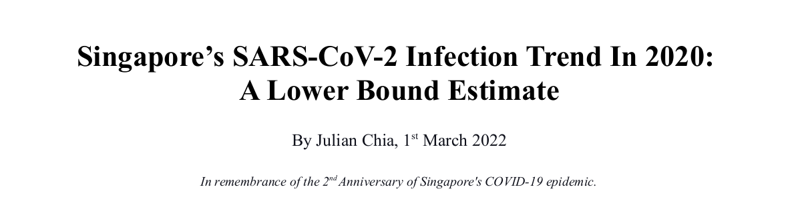

## Content:
This repository contains its:
- manuscript in pdf format
- manuscript's figures
- proposed model source codes that are written in Python3, NumPy and SciPy.
- source codes (Python3 & Matplotlib) to plot the manuscript figures and tables.
- empirical data on SG's Imported and Local COVID-19 epidemic trends from 23rd January to 18th August 2020 and COVID19 Confirmed Cases Info till 27th May 2020.

## Dependencies
Execution of this respositry's source code requires your system to have _Python3_, _NumPy_, _SciPy_ and _Matplotlib_ installed.

## Motivation
The outset of the COVID-19 epidemic in Singapore in 2020 is a monumental milestone. It revolutionised lifestyle and business practices; worldviews changed. To mitigate COVID-19 and help Singapore weather uncertainties, Singapore spent a portion of its national reserve and GDP. Personally, these events motivated me to understand how COVID-19 became an epidemic in Singapore.

## Summary
One of my early realisations is that Singapore's health authorities rely on late-stage disease situational information to report Singapore's COVID-19 population. The national daily COVID-19 epidemic trends, although insightful, do not describe the viral/epidemic situation in "real-time". Instead, a national daily SARS-CoV-2 infection trend is needed. But, how can it be obtained?

Towards this end, I developed a model to "extract" lower-bound estimates of Singapore's daily SARS-CoV-2 infection trend from its daily COVID-19 epidemic trend and a few statistical parameters from the confirmation period of a sample of its COVID-19 cases. Its results show the model works.

Furthermore, my research found that:

1. Singapore had an early window of opportunity to mitigate its COVID-19 epidemic with its Circuit Breaker, but it was unseized. An extended Circuit Breaker with tighter mitigation measures to quell Singapore's COVID-19 epidemic then needed implementation even having reduced its period to confirm COVID-19 cases.

2. Many people with SARS-CoV-2 who ultimately had COVID-19 remained unidentified until a later point in time. I believe this factor is one of the reasons for the epidemic nature of COVID-19 in Singapore and its protracted recovery.

3. The influx of Imported COVID-19 individuals in March 2020 caused Singapore's COVID-19 epidemic

## Research Manuscript
It is available in both [pdf](https://github.com/JulianChia/lowerboundSARSCOV2/blob/main/Singapore%E2%80%99s%20SARS-CoV-2%20Infection%20Trend%20In%202020:%20A%20Lower%20Bound%20Estimate.pdf) and [html](https://julianchia.github.io/lowerboundSARSCOV2/) formats.

I believe this model can help study your country/state/city/town's COVID-19 epidemic and even future epidemics. Also, I hope it can serve as a basis for you to advance even better models for viral infection analysis.
